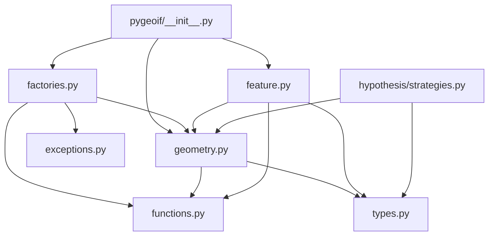
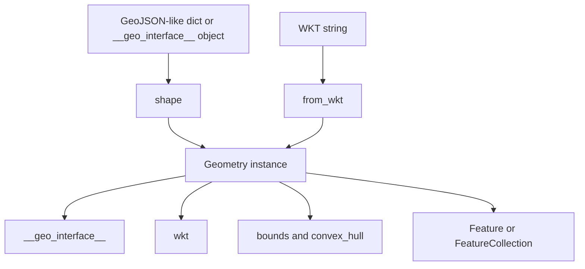

`pygeoif` keeps its design intentionally small. The package root in `pygeoif/__init__.py` re-exports the geometry classes from `pygeoif/geometry.py`, feature wrappers from `pygeoif/feature.py`, and the main conversion helpers from `pygeoif/factories.py`. Those layers sit on top of shared types from `pygeoif/types.py`, algorithms from `pygeoif/functions.py`, and a few custom exceptions from `pygeoif/exceptions.py`.

## Module Responsibilities

- `pygeoif/geometry.py` defines the immutable value objects: `Point`, `LineString`, `LinearRing`, `Polygon`, `MultiPoint`, `MultiLineString`, `MultiPolygon`, and `GeometryCollection`.
- `pygeoif/functions.py` implements shared computational helpers such as `signed_area()`, `centroid()`, `convex_hull()`, coordinate comparison, and recursive coordinate movement.
- `pygeoif/factories.py` converts between external representations and geometry objects. That includes `shape()`, `mapping()`, `from_wkt()`, `force_2d()`, `force_3d()`, `box()`, and `orient()`.
- `pygeoif/feature.py` wraps geometries in GeoJSON-style `Feature` and `FeatureCollection` containers.
- `pygeoif/types.py` centralizes public type aliases and `TypedDict`/`Protocol` definitions used throughout the package.
- `pygeoif/hypothesis/strategies.py` builds optional Hypothesis strategies on top of the geometry constructors.

## Data Flow

The most common lifecycle starts with external coordinates, a GeoJSON-like mapping, or a WKT string. `shape()` and `from_wkt()` parse those inputs in `pygeoif/factories.py`, instantiate the correct class from `pygeoif/geometry.py`, and return an immutable object. Once a geometry exists, its `.wkt`, `.bounds`, `.convex_hull`, and `.__geo_interface__` properties depend on shared algorithms from `pygeoif/functions.py`. Feature wrappers then embed those objects inside `Feature` and `FeatureCollection` containers without changing the underlying geometry.

## Key Design Decisions

### Immutable geometry objects

The internal base class `_Geometry` in `pygeoif/geometry.py` overrides `__setattr__` and `__delattr__` to reject mutation after construction. The concrete classes only assign state through `object.__setattr__` during initialization. That decision makes geometry instances reliable value objects: equality, hashing behavior from the stored tuples, and repeated serialization stay stable once constructed.

### Copying external geometry instead of aliasing it

`shape()` in `pygeoif/factories.py` converts mappings into new geometry objects instead of returning a wrapper over the original structure. The docstring explicitly says coordinates are copied. That avoids a common interoperability bug where a library stores someone else’s mutable dictionary and later observes unexpected changes.

### Shared algorithms, not duplicated logic

`pygeoif/functions.py` contains the reusable math and recursive traversal logic. `geometry.py` delegates to `convex_hull()`, `centroid()`, `signed_area()`, `compare_coordinates()`, and `compare_geo_interface()` instead of reimplementing those calculations per class. That keeps behavior consistent between single geometries, multi-geometries, factories, and feature comparisons.

### Dimension handling through coercion helpers

The project deliberately separates dimensional coercion from normal construction. Constructors enforce internally consistent point dimensions, while `force_2d()` and `force_3d()` in `pygeoif/factories.py` rebuild geometries by moving their `__geo_interface__` with `move_geo_interface()`. That means the rules for dropping or adding Z values are centralized, predictable, and reusable across every geometry type including `GeometryCollection`.

## Configuration Surface

There are no environment variables, global registries, or mutable runtime settings. Configuration is limited to constructor and helper parameters:

| Surface | Parameters | Purpose |
|---|---|---|
| Geometry constructors | Coordinates and optional `holes` or `unique` flags | Build immutable geometry values |
| Factory helpers | `ccw`, `z`, bounding box coordinates, or WKT string input | Convert or normalize shapes |
| Hypothesis strategies | `srs`, `has_z`, `max_points`, `max_interiors`, and related bounds | Generate constrained random geometries |

That narrow configuration surface is a deliberate architectural choice. You do not initialize a global client or session object. You construct values, derive alternate views of those values, and pass them into surrounding code.

## How The Pieces Fit Together

If you create a `Polygon`, `geometry.py` stores its exterior and interior rings as `LinearRing` instances. If you call `orient()`, `factories.py` reads the exterior and interior coordinates, uses `signed_area()` from `functions.py` to decide whether a reversal is needed, and returns a new `Polygon`. If you then wrap that polygon in a `Feature`, `feature.py` simply assembles the geometry’s existing `__geo_interface__` and bounds into a GeoJSON Feature mapping.

That pattern shows up everywhere in `pygeoif`: small immutable objects, thin conversion helpers, and algorithm utilities shared across the package. The result is a library that stays easy to reason about even when you use several modules together.
