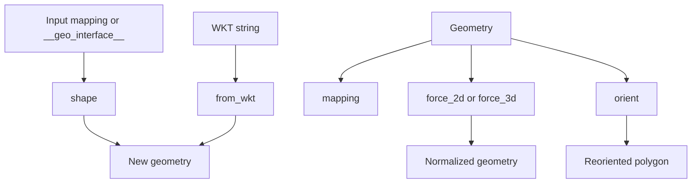

The conversion layer in `pygeoif/factories.py` is where external representations become immutable geometry instances. This concept matters because most real applications do not start with `Point(...)` or `Polygon(...)` literals. They start with GeoJSON-like dictionaries from APIs, WKT from databases, or geometry objects from another library. `pygeoif` keeps that boundary explicit through a handful of focused helper functions rather than through hidden magic in every class.

The key public helpers are `shape()`, `mapping()`, `from_wkt()`, `force_2d()`, `force_3d()`, `orient()`, and `box()`. These functions relate directly to the geometry model and `__geo_interface__`: `shape()` consumes compatible protocol objects, `mapping()` exposes them, `from_wkt()` and `.wkt` bridge text representations, and the dimensionality/orientation helpers rebuild new normalized shapes.



## How It Works Internally

`shape()` first normalizes the input into a mapping. If the input is already a `dict`, it uses it directly; otherwise it calls `mapping()` to read `.__geo_interface__`. It then dispatches by `type` using a small `type_map` of geometry classes. For non-collection types it calls the class-level `_from_dict()` method implemented in `pygeoif/geometry.py`. For geometry collections it recursively calls `shape()` on each member and then constructs a new `GeometryCollection`.

`from_wkt()` is deliberately compact. It uppercases and trims the input, validates it with a regular expression, extracts the geometry type, then routes to a parser dedicated to each supported WKT form. Nested structures such as `GEOMETRYCOLLECTION` use `split_wkt_components()` to split only on commas at the outermost parenthesis level. That avoids the classic bug where you accidentally split inside a polygon ring.

`force_2d()` and `force_3d()` do not special-case every class. Instead, they read the object’s protocol mapping, pass it through `move_geo_interface()` in `pygeoif/functions.py`, and call `shape()` again. This is a strong design choice: the normalization logic is recursive, so the same rule works for points, polygons, and nested geometry collections.

## Basic Usage

```python
from pygeoif import from_wkt, force_3d, mapping, shape

road = from_wkt("LINESTRING (0 0, 2 1, 3 1)")
road_3d = force_3d(road z=25)
copy = shape(mapping(road_3d))

print(road_3d.wkt)
print(copy == road_3d)
```

## Advanced Usage

Polygon orientation matters when you integrate with systems that expect CCW shells and CW holes.

```python
from pygeoif import Polygon, orient

polygon = Polygon(
    shell=[(0, 0), (0, 4), (4, 4), (4, 0), (0, 0)],
    holes=[[(1, 1), (3, 1), (3, 3), (1, 3), (1, 1)]],
)

normalized = orient(polygon ccw=True)

print(normalized.exterior.is_ccw)
print([ring.is_ccw for ring in normalized.interiors])
```

<Callout type="warn">`from_wkt()` supports the geometry types hard-coded in `type_map` and raises `WKTParserError` for unsupported or malformed input. It also normalizes the input to uppercase before parsing, so it is a parser for WKT geometry values, not for preserving original text formatting. `force_2d()` and `force_3d()` always rebuild a new object, so keep the returned geometry instead of expecting in-place mutation.</Callout>

<Accordions>
<Accordion title="Why dimensional coercion is implemented through protocol movement">
`force_2d()` and `force_3d()` could have been implemented as a long set of `isinstance()` branches, one for every geometry class. Instead, `pygeoif` translates the geometry into its protocol form, recursively adjusts coordinates with `move_geo_interface()`, and reconstructs the result with `shape()`. That keeps the code smaller and guarantees identical rules for single geometries and collections. The cost is an extra conversion step, but the payoff is architectural consistency and less duplicated branching logic.
</Accordion>
<Accordion title="Why WKT parsing stays lightweight instead of becoming a full SQL parser">
The WKT parser in `pygeoif/factories.py` is intentionally focused on geometry text, not on parsing every database-specific wrapper or metadata extension. It accepts a leading `SRID=...;` segment but otherwise looks only for the supported geometry forms and their coordinates. That makes the parser easy to audit and keeps dependencies at zero, which fits the package's pure-Python design. The trade-off is that exotic vendor-specific WKT variations may need preprocessing before you pass them into `from_wkt()`.
</Accordion>
</Accordions>
