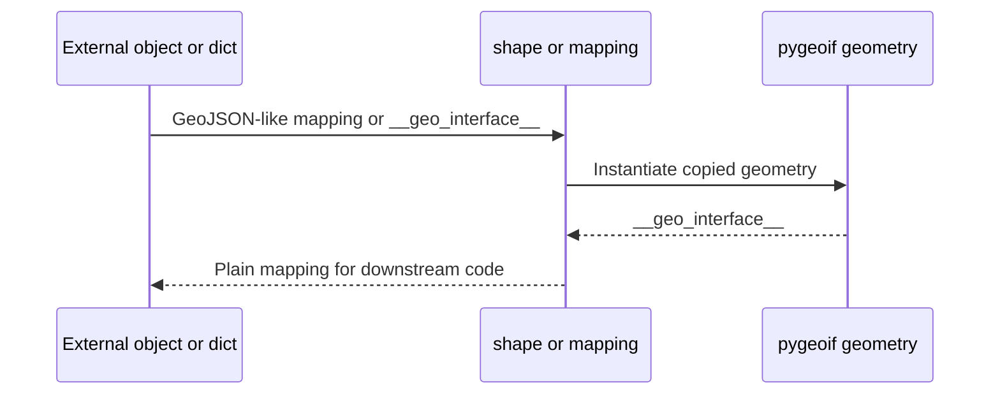

The `__geo_interface__` protocol is the interoperability contract at the center of `pygeoif`. Every geometry class, `Feature`, and `FeatureCollection` exposes a GeoJSON-like mapping through a `.__geo_interface__` property. The protocol exists so objects from unrelated libraries can exchange geometry data without sharing the same class hierarchy, database client, or serialization format.

Inside `pygeoif`, this concept ties everything together. `mapping()` returns the raw protocol mapping from any compatible object, `shape()` turns a mapping or any `__geo_interface__` object back into a new `pygeoif` geometry, and equality helpers in `pygeoif/functions.py` compare protocol representations rather than relying on identity.



## How It Works Internally

The base implementation in `_Geometry.__geo_interface__` returns a mapping with `type`, `bbox`, and a placeholder `coordinates` field. Each concrete class fills in the actual coordinates. `Point.__geo_interface__` writes a single point tuple, `LineString.__geo_interface__` writes a tuple of coordinate tuples, and `Polygon.__geo_interface__` writes the exterior ring followed by any interior rings. `GeometryCollection` is special: its override returns `type: "GeometryCollection"` and a `geometries` sequence instead of `coordinates`.

`Feature.__geo_interface__` in `pygeoif/feature.py` embeds the wrapped geometry’s protocol output and adds `properties`, `bbox`, and optional `id`. `FeatureCollection.__geo_interface__` then aggregates many features. On the reverse path, `shape()` in `pygeoif/factories.py` switches on the incoming `type` field, dispatches to the correct class `_from_dict()` constructor, and recursively rebuilds geometry collections.

## Basic Usage

```python
from pygeoif import Point, mapping, shape

point = Point(4, 5)
payload = mapping(point)
copy = shape(payload)

print(payload)
print(copy == point)
```

## Advanced Usage

You can bridge custom classes into `pygeoif` as long as they expose a conforming `__geo_interface__`.

```python
from pygeoif import shape


class VendorPolygon:
    @property
    def __geo_interface__(self):
        return {
            "type": "Polygon",
            "coordinates": (((0, 0), (2, 0), (2, 1), (0, 1), (0, 0)),),
        }


polygon = shape(VendorPolygon())
print(polygon.wkt)
print(polygon.bounds)
```

<Callout type="warn">Empty geometries do not produce a usable `__geo_interface__`. `_Geometry.__geo_interface__` raises `AttributeError("Empty Geometry")` when `is_empty` is true, so code that serializes arbitrary inputs should check truthiness or `is_empty` first. Also remember that `shape()` only supports the geometry types implemented in `pygeoif`; unknown `type` values raise `NotImplementedError`.</Callout>

<Accordions>
<Accordion title="Why pygeoif returns tuples instead of mutable GeoJSON lists">
The protocol is GeoJSON-like, not a literal JSON serializer. `pygeoif` returns tuples because its own object model is immutable and tuple output preserves that intent at the Python level. This means the protocol output is excellent for internal interoperability and comparison, but if you need strict JSON you may still want to convert tuples to lists before encoding. The advantage is that round-tripping through `shape()` and `mapping()` keeps data stable and hash-friendly for Python code.
</Accordion>
<Accordion title="Protocol compatibility versus full GeoJSON behavior">
`pygeoif` focuses on the geometry and feature mapping contract rather than implementing every concern of a full GeoJSON toolkit. There is no CRS management layer, streaming parser, or validation engine attached to `__geo_interface__`. That keeps the package lightweight and easy to embed, but it also means malformed or semantically invalid geometry can still exist as long as it fits the expected structure. Use `pygeoif` as a geometry value layer, not as a full GeoJSON governance framework.
</Accordion>
</Accordions>
