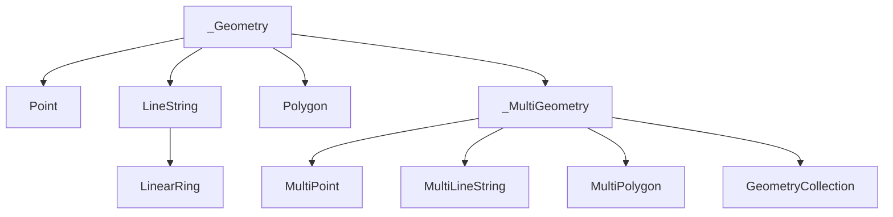

The core abstraction in `pygeoif` is the immutable geometry value object defined in `pygeoif/geometry.py`. Every concrete geometry inherits from the internal `_Geometry` base class, which provides shared behavior such as `.bounds`, `.convex_hull`, `.wkt`, `.__geo_interface__`, truthiness, and equality. This abstraction exists so all geometry types can be created, compared, serialized, and transformed with the same mental model even though their coordinate layouts differ.

`Point`, `LineString`, `LinearRing`, and `Polygon` represent single geometries. `MultiPoint`, `MultiLineString`, `MultiPolygon`, and `GeometryCollection` wrap many geometries while still behaving like immutable values. Related concepts build directly on top of this model: factories create geometry objects, feature wrappers embed them, and the Hypothesis strategies generate them.



## How It Works Internally

Immutability is enforced in `_Geometry` by overriding `__setattr__` and `__delattr__` to always raise `AttributeError`. Concrete classes bypass that restriction only inside their constructors via `object.__setattr__`. For example, `Point.__init__` stores either `(x, y)` or `(x, y, z)`, while `LineString.__init__` delegates coordinate normalization to `_set_geoms()`, which deduplicates consecutive coordinates and rejects mixed dimensionality with `DimensionError`.

The shared `.convex_hull` property in `_Geometry` is also worth understanding. It calls `self._prepare_hull()` on the concrete geometry, feeds those 2D points into `convex_hull()` from `pygeoif/functions.py`, and then collapses the result back into `Point`, `LineString`, or `Polygon` depending on how many hull vertices remain. That is why a degenerate polygon can return a line or point instead of always returning a polygon.

Multi-geometries use `_MultiGeometry` to share iteration, emptiness checks, bounds aggregation, and Z-dimension detection. The design keeps each concrete class small: `MultiPoint`, `MultiLineString`, and `MultiPolygon` mainly define construction, WKT formatting, and `__geo_interface__` serialization, while `_MultiGeometry` handles most of the cross-cutting behavior.

## Basic Usage

```python
from pygeoif import Point, LineString, Polygon

point = Point(1.5, 2.0)
line = LineString([(0, 0), (1, 1), (2, 1)])
polygon = Polygon([(0, 0), (3, 0), (3, 2), (0, 2), (0, 0)])

print(point.bounds)
print(line.wkt)
print(polygon.convex_hull.wkt)
```

## Advanced Usage

The shared geometry model also handles empty or degenerate inputs in predictable ways.

```python
from math import nan
from pygeoif import Point, Polygon

empty_point = Point(1, nan)
degenerate_polygon = Polygon([(0, 0), (1, 1), (2, 2)])

print(bool(empty_point))
print(empty_point.wkt)
print(degenerate_polygon.convex_hull)
```

In this example the point becomes empty because one coordinate is `NaN`, and the polygon’s convex hull collapses into a `LineString` because all vertices lie on the same line.

<Callout type="warn">`LineString` removes only consecutive duplicate coordinates in `LineString._set_geoms()`. Non-adjacent duplicates are preserved, so you should not assume input lines are globally unique. Also note that a 3D geometry's `convex_hull` works on its XY projection and may drop Z information by design.</Callout>

<Accordions>
<Accordion title="Why value objects instead of mutable geometries">
`pygeoif` chooses immutability so geometry instances behave predictably in serialization and equality checks. Once a geometry is created, `.wkt`, `.bounds`, and `.__geo_interface__` cannot silently diverge because some other part of the program edited coordinates in place. That makes `Feature` wrappers safer too, because they can hold a geometry reference without worrying about later mutation. The trade-off is that normalization operations such as `force_2d()` or `orient()` always allocate a new geometry instead of modifying the old one, so you need to plan for explicit replacement in your own code.
</Accordion>
<Accordion title="Why multi-geometries do not expose a unified .coords property">
`_MultiGeometry.coords` deliberately raises `NotImplementedError` in `pygeoif/geometry.py`. A single coordinate sequence would blur the semantic boundary between `MultiPoint`, `MultiPolygon`, and `GeometryCollection`, and it would be ambiguous for nested collections. By forcing callers to iterate `geoms`, the library keeps the container shape explicit and prevents accidental flattening of structured data. The trade-off is a little more code when you want to transform a collection, but the result is much clearer and maps cleanly to GeoJSON.
</Accordion>
</Accordions>
